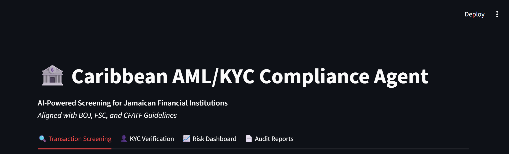
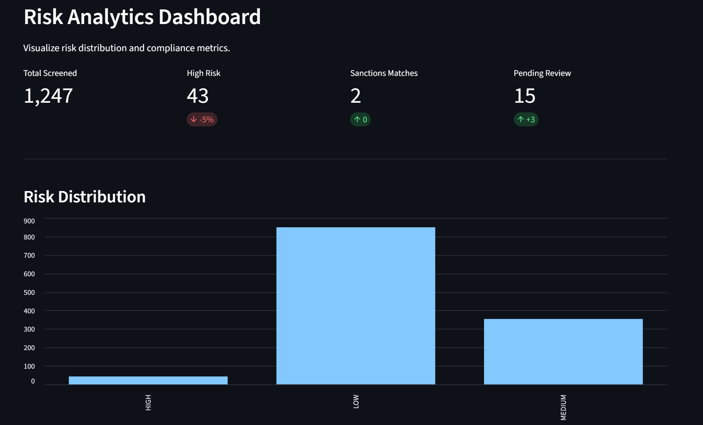
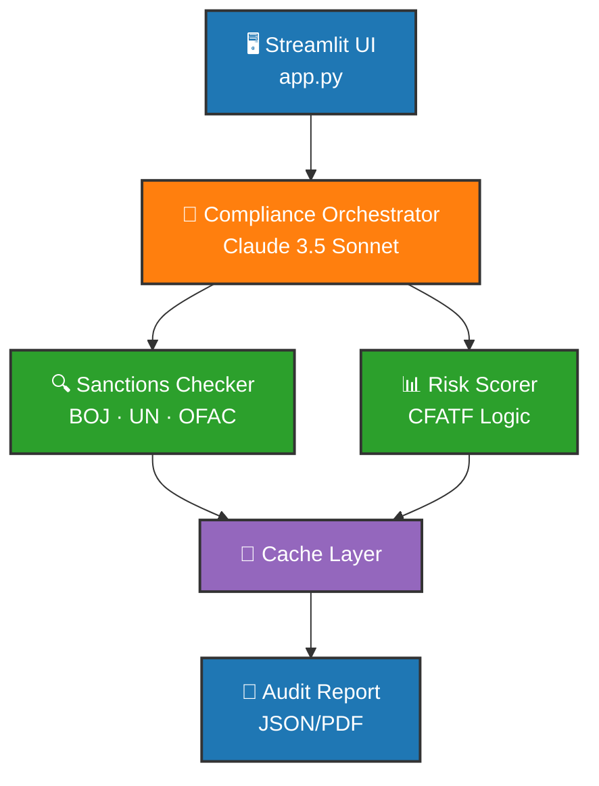

# 🏦 Caribbean AML/KYC Compliance AI Agent

> **Automating Financial Crime Compliance for Jamaican & Caribbean Financial Institutions**

[](https://www.python.org/downloads/)
[](https://streamlit.io)
[](https://opensource.org/licenses/MIT)
[](https://your-app.streamlit.app)

---

## 📌 Overview

This project is an **agentic AI system** designed to assist compliance officers in Jamaican and Caribbean financial institutions. It automates transaction screening, KYC verification, and risk scoring while adhering to **CFATF**, **Bank of Jamaica (BOJ)**, and **POCA** regulations.

**Key Features:**
- 🇯🇲 **Regional Focus:** Calibrated for Caribbean compliance (CFATF, BOJ, FSC)
- 🤖 **AI-Powered:** Uses Claude 3.5 Sonnet for risk analysis and reasoning
- 💾 **Cost-Optimized:** Response caching reduces API costs by 90%
- 📊 **Interactive UI:** Streamlit dashboard for real-time screening
- 🔒 **Privacy-First:** Uses synthetic data (no real PII processed)

---

## 📸 Demo Screenshots

### High-Risk Transaction Detection


### AI Reasoning Trace


### Risk Analytics Dashboard


---

## 🏗️ Architecture



---

## 🧰 Tech Stack

| Category | Technology |
|----------|------------|
| **Language** | Python 3.11+ |
| **LLM** | Anthropic Claude 3.5 Sonnet |
| **UI Framework** | Streamlit |
| **API Management** | python-dotenv, Anthropic SDK |
| **Caching** | Custom JSON Cache |
| **Data** | Synthetic JSON datasets 

### Compliance Frameworks
- **Regional:** CFATF, Bank of Jamaica (BOJ), POCA Jamaica
- **Global:** FATF 40 Recommendations, UN Sanctions, OFAC

---

## 📁 Project Structure

```
AML-KYC-Compliance-AI-Agent/
├── agents/           # AI agent orchestration logic
├── tools/            # Compliance screening tools
├── utils/            # Caching and helper utilities
├── data/             # Mock sanctions & PEP datasets
├── prompts/          # LLM system prompts
├── images/           # README screenshots
├── app.py            # Streamlit UI entry point
├── config.py         # Configuration management
└── requirements.txt  # Python dependencies

```

---

## 🚀 Getting Started

### Prerequisites

- Python 3.11+
- Anthropic API key

### 1. Clone the repository

```bash
git clone https://github.com/your-username/aml-kyc-compliance-agent.git
cd aml-kyc-compliance-agent
```

### 2. Install dependencies

```bash
pip install -r requirements.txt
```

### 3. Configure environment variables

```bash
cp .env.example .env
```

Edit `.env`:

```env
ANTHROPIC_API_KEY=your_api_key_here
SANCTIONS_API_URL=https://your-sanctions-api.com
PEP_REGISTRY_URL=https://your-pep-registry.com
RISK_THRESHOLD_HIGH=0.75
RISK_THRESHOLD_MEDIUM=0.45
```

### 5. Run the agent

```bash
python agents/orchestrator.py --input data/transactions.json
```

---

## 🧪 Evaluation

Run the built-in evaluation suite against labelled compliance test cases:

```bash
python evals/run_evals.py
```

Evaluation metrics include:
- True positive rate on SAR-labelled transactions
- False positive rate on clean customer profiles
- Report generation accuracy and completeness
- Agent reasoning trace quality

---

## 🤝 Contributing

Contributions are welcome. Please open an issue first to discuss proposed changes. Ensure all new tools include evaluation test cases.

---

## 📄 License

MIT License — see [LICENSE](LICENSE) for details.

---

## 🙏 Acknowledgements

Built with [VSCode Foundry Toolkit](https://code.visualstudio.com/docs/intelligentapps/overview) · Powered by [Claude](https://www.anthropic.com/claude) by Anthropic